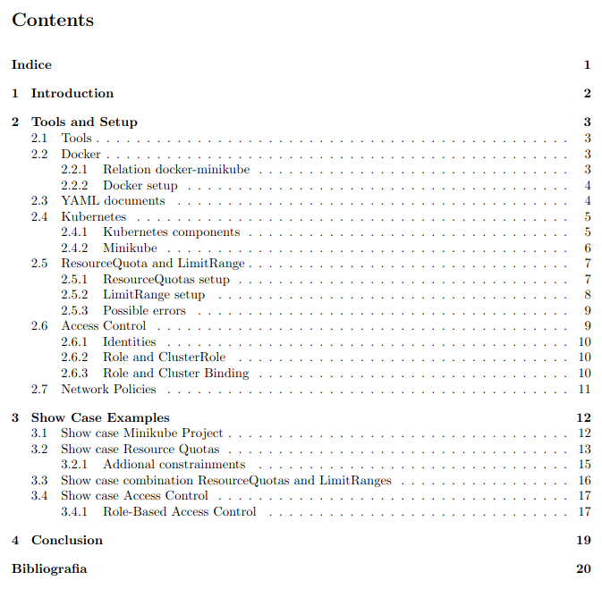

# Resource-Usage Limitation
This lab was created by the Cybersecurity course of Politecnico di Torino, which requires the complete creation of a laboratory activity based on the concepts of “domains of protection”
or “multi-tenancy”, starting from the ResourceQuotas feature of Kubernetes and searching for other technologies for resource usage limitation. \
The relative documentations can be found in the pdf inside "documents" directory.

  

